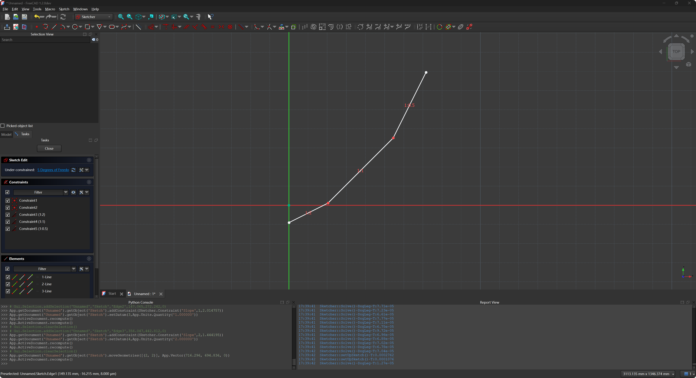

# Add Slope Constraint to the freecad sketcher module

> [!NOTE]
>
> for development,please check the freecad source code version is 1.2.0;

the development process for the slope constraint helps to understand the freecad sketcher module constraint system.
